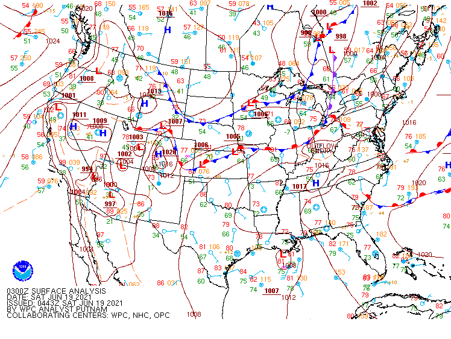

# Public summary

# Analysis
The sections below give a more thorough analysis of the June 18--19, 2021 flood event in Bloomington, IN. 

## Meteorological conditions
The flood was caused by a large amount of precipitation from a [mesoscale convective system (MCS)](https://glossary.ametsoc.org/wiki/Mesoscale_convective_system) associated with a stationary front (see NWS analysis below).  The MCS strengthened overnight on June 18 and remained stationary; precipitation from the storm continued through June 19.  A weather station in Bloomington, IN recorded over 10,000 lightning strikes within a 30 mile radius overnight.

[Local weather observers](https://maps.cocorahs.org/?maptype=precip&units=us&base=std&cp=BluYlwRed&datetype=daily&displayna=0&date=2021-06-19&key=dynamic&overlays=state,county&bbox=-87.06115722656251,38.9524673652846,-86.0723876953125,39.3995914050189) recorded 5--7 inches of rainfall within a 24 hour period.

**Caption** Surface analysis from the [National Weather Service](https://weather.gov) analyzed at approximately 11pm Eastern Friday June 18, 2021.

## Historical records

**Caption** Annual maximum daily precipitation rates for Bloomington, IN from 1895 to 2020.  An estimate of the June 18--19, 2021 flood event total, based on preliminary data from [CoCoRaHS](https://maps.cocorahs.org/?maptype=precip&units=us&base=std&cp=BluYlwRed&datetype=daily&displayna=0&date=2021-06-19&key=dynamic&overlays=state,county&bbox=-87.06115722656251,38.9524673652846,-86.0723876953125,39.3995914050189), is shown as the shaded crimson bar at the right of the graph.  The event ranks somewhere between the 1st--3rd highest daily total on record.

## Did climate change cause this event?
This is a common question about disasters caused by extreme weather events, however it is an ill-posed question, since extreme weather events like this can and have (in the past) happened in the absence of climate change.  Here are a couple alternate, well-posed questions with answerws that are backed by a host peer-reviewed literature:

### Have we observed changes in extreme rainfall like this?
Analysis of precipitation observations shows that the intensity of the 20 year storm (a storm so strong it is only likely to happen once every 20 years) may have increased by approximately 10% over the last century over Indiana (Risser et al., 2019).  The short record makes it difficult to distinguish this trend from noise in the data.  The increasing trend is consistent with theoretical expectations and with climate model simulations (IPCC 2014 and references within), which builds confidence that the observed trend is real and not a statistical artifact.

### How might floods like this change in the future?
Climate model simulations indicate that climate change will (1) increase the frequency of MCS, (2)  cause MCS to cover larger areas, and (3)  to deliver more rainfall in total (Prein et al., 2017).  The overall effect is an increase in the volume of precipitation from these distruptive systems, consistent with the large amount of rainfall delivered over the Bloomington area in the June 18-19, 2021 flood.

1. Risser, M. D., Paciorek, C. J., O’Brien, T. A., Wehner, M. F. & Collins, W. D. Detected Changes in Precipitation Extremes at Their Native Scales Derived from In Situ Measurements. J. Clim. 32, 8087–8109 (2019).
2. Intergovernmental Panel on Climate Change. Climate Change 2014: Synthesis Report; Chapter Observed Changes and their Causes. (2014). doi:10.1046/j.1365-2559.2002.1340a.x
3. Prein, A. F. et al. Increased rainfall volume from future convective storms in the US. Nat. Clim. Chang. 7, 880–884 (2017).

# Copyright
 This work is licensed under a <a rel="license" href="http://creativecommons.org/licenses/by/4.0/">Creative Commons Attribution 4.0 International License</a>.  See *About the authors* for author information.

# Funding

Effort on this work was partially supported by the [Environmental Resilience Institute](https://eri.iu.edu/) at Indiana University: part of the Prepared for Environmental Change Grand Challenge.
  
This research was supported in part by Lilly Endowment, Inc., through its support for the Indiana University Pervasive Technology Institute.  The authors acknowledge the Indiana University Pervasive Technology Institute for providing supercomputing and storage resources that have contributed to the research results reported within this work. 
  
# About the authors
This statement was last update 6/19/2021 
